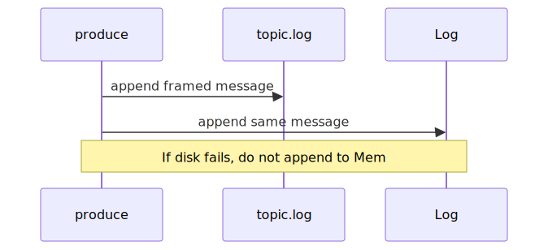

# herbatka

"Do nothing which is of no use." - Miyamoto Musashi

A lightweight event streaming broker inspired by Apache Kafka, focused on simplicity, resilience, and fast iteration.

## Documentation

- [Why](docs/why.md) - purpose and philosophy
- [What](docs/what.md) - concrete features and commands
- [How](docs/how.md) - principles and architecture
- [UI Draft](docs/ui-draft.md) - map-first fleet UI wireframe and Mermaid source
- [Simulator Guide](docs/simulator.md) - simulator flags, counters, and troubleshooting
- [Test Harness](docs/test-harness.md) - deterministic local smoke flow

## Architecture Overview

## Produce path

On `produce`, the broker appends to the active topic segment on disk first, then to the in-memory `Log`.
Disk write always happens before memory advance; if disk append fails, memory is not advanced.
Durability behavior is controlled by `fsync_policy` in config (`always` by default).

## TCP quickstart

The broker listens at `listen_addr` in `herbatka.toml` (default `127.0.0.1:7000`).

Broker startup loads `herbatka.toml` from the **current working directory** by default.
You can override config path with `HERBATKA_CONFIG=/path/to/file.toml`.

### Terminal 1 (broker)

`cargo run --bin herbatka`

### Terminal 2 (producer)

`cargo run --bin producer -- 127.0.0.1:7000 t hello`

Expected:

- `OK <offset>`

### Terminal 3 (consumer)

`cargo run --bin consumer -- 127.0.0.1:7000 t 0`

## Simulator quickstart

Run simulator with scenario, load profile, and seed:

`cargo run --bin simulator -- --addr 127.0.0.1:7000 --topic events --vehicles 5 --rate 10 --duration-secs 5 --scenario burst --load-profile ramp --seed 42`

Optional flags:

- `--quiet` disables periodic progress logs and prints only final summary
- `--scenario` chooses event behavior (`steady`, `burst`, `idle`, `reconnect`)
- `--load-profile` modulates effective traffic intensity over time (`constant`, `ramp`, `spike`)
- `--seed` makes scenario variation reproducible

Reliability and observability behavior:

- bounded retry/backoff for connect/reconnect paths
- categorized final counters (connect/write/read/non-OK/reconnect/skipped)
- non-zero exit when simulation completes with no successful sends

Expected summary format:

- `simulation done: ok=<n>, err=<n>, total=<n> | connect_err=<n> ...`

## UI quickstart

Run the UI shell:

`cargo run --bin ui`

## Roadmap notes

- Keep work in small, reviewable steps.
- Prefer simple defaults before adding complex features.
