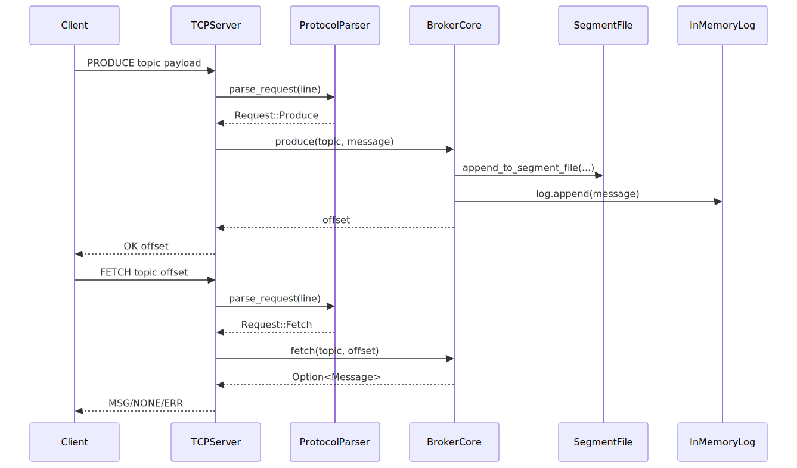

# HOW

## Approach
How the project solves the problem.

High-level strategy.

## Architecture
Main components and their responsibilities.

### Request flow

`PRODUCE` and `FETCH` processing from client through TCP server/protocol to broker.

### Persistence and recovery

Startup topic discovery/replay and produce path persistence/retention lifecycle.

### Replay segment recovery (corrupted-tail handling)

Startup replay behavior for clean EOF, truncated tail (`UnexpectedEof`), and hard-fail corruption paths.

### Simulator load behavior

How `--scenario` and `--load-profile` combine into effective event cadence.

### UI draft (map-first fleet view)

First-pass layout for a Rust desktop UI (`egui`-first), centered on a vehicle map with telemetry and broker/simulator controls.

- Draft doc: [UI Draft](ui-draft.md)
- Mermaid source: `../assets/diagrams/mmd/fleet-ui-draft.mmd`
- SVG preview: `../assets/diagrams/svg/fleet-ui-draft.svg`

## Design Principles
Rules for implementation.

Examples:

## Decisions
Important decisions and their reasoning.

Example:
I am using LibA instead of LibB, because...
Advantages:
    better for usecaseA
Downside:
    lack of featureC

## Workflow
Typical usage flow.

Example:

## Constraints
Technical constraints.

Examples:

###
template generated with nooj