# UI Draft (Map-First Fleet View)

First draft for a minimal Rust desktop UI (`egui`-first) that is centered on live vehicle positions, with telemetry and process control beside the map.

## Mermaid source

Source of truth for iteration (edit here only; do not duplicate the diagram in this file):

- [`../../assets/diagrams/mmd/fleet-ui-draft.mmd`](../../assets/diagrams/mmd/fleet-ui-draft.mmd)

Regenerate the SVG from repo root:

`npx -y @mermaid-js/mermaid-cli -i assets/diagrams/mmd/fleet-ui-draft.mmd -o assets/diagrams/svg/fleet-ui-draft.svg`

## SVG preview

Rendered static draft:

